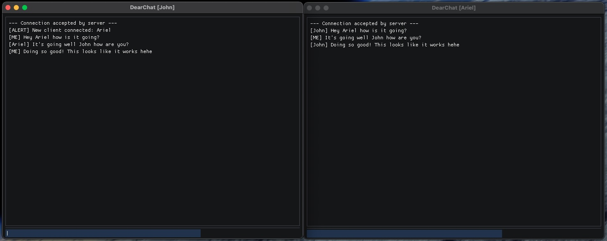

# DearChat
A chat client using DearImGui, zpp_bits, and zeromq.

<p align="center">
    
    <i>Two chat clients talking to each other</i>
</p>


## Developer stuff

### Build Instructions
```
mkdir build
cd build
cmake ..
make -j10
```

Run Client GUI
```
./client_gui <name of client>
```

Run Server
```
./server
```

### Known Bugs
---
<b>BUG 1</b><br>
When the server is not running and the client gui is booted up and then closed with the red X, the program hangs and never closes even though the window closes.

- potentially something with ZMQ sockets never connecting to the server and thus some deadlock or something
- maybe send some special message to our agent when we close the window? IDK
---